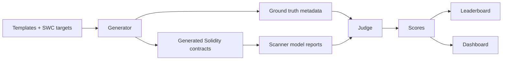

# Methodology

This benchmark evaluates how well LLMs detect Solidity smart contract
vulnerabilities when the test cases are generated fresh instead of pulled from a
fixed public dataset.

## Objective

The goal is to compare scanner models on practical audit usefulness:

- whether the model detects the vulnerability
- whether it names the correct SWC class
- whether severity and location are useful
- whether the explanation is actionable
- how much the scan would cost at commercial list prices

The benchmark is designed as reusable infrastructure. Any audit firm,
researcher, or model team can run the same generator, scanner, judge, and
scoring pipeline against their own model lineup.

## Pipeline

1. Contract templates define clean Solidity patterns.
2. A generator model injects known SWC-class vulnerabilities.
3. Generated contract metadata stores the ground truth.
4. Scanner models inspect the vulnerable contracts without seeing ground truth.
5. A judge model compares scanner reports against ground truth.
6. Scoring code produces quality and cost-adjusted leaderboards.
7. Dashboard data is bundled from the benchmark output JSON.



## Generation

The generator creates vulnerable Solidity contracts from the configured SWC
categories and templates. Each generated case includes metadata that records the
expected vulnerability class and supporting context.

This reduces benchmark overfitting risk because models cannot memorize one
static public test set. New runs can produce new contracts while preserving the
same category-level evaluation target.

## Scanning

Scanner models receive the generated contracts and produce vulnerability
reports. The default v1.0.0 scanner lineup compares three open-weight model
philosophies:

| Model | Philosophy |
|---|---|
| `nim:qwen/qwen3-coder-480b-a35b-instruct` | Code-specialist 480B model |
| `nim:minimaxai/minimax-m2.7` | Code plus reasoning hybrid |
| `nim:stepfun-ai/step-3.5-flash` | Pure reasoning sparse MoE |

Additional scanner models can be added with:

```bash
python src/main.py --scanner-models "provider/model-id"
```

## Judging

The judge receives the scanner output and the ground truth metadata. It grades
scanner performance on detection, SWC classification, severity, source location,
and explanation quality.

The judge is intentionally kept outside the scanner pool when possible. That
separation reduces self-judging bias and makes the benchmark easier to extend
when new scanner models are added.

## Scoring

The benchmark reports two leaderboards:

- Pure quality: composite of detection rate, SWC accuracy, severity, location,
  and explanation quality.
- Cost-adjusted: quality score divided by commercial list-price scan cost.

Cost-adjusted scoring uses model price metadata, not free-tier spend. This makes
the result more useful for audit firms deciding what a production scanner stack
would cost.

## Static Analyzer Baselines

The project includes static analyzer comparators for:

- heuristic fallback checks
- Slither, when available
- Aderyn, when available

These baselines are not treated as replacements for LLM scanners. They provide a
sanity-check row and help identify cases where deterministic tools already cover
a vulnerability class.

## Reproducibility

To reproduce the published v1.0.0 benchmark shape:

```bash
./run.sh --prepare-only
source .venv/bin/activate
python src/main.py
```

The primary outputs are:

- `output/leaderboard.json`
- `output/judge_scores/`
- `data/generated_contracts/`
- `dashboard/public/data/`

Because generation is self-renewing, exact results can move across fresh runs.
The checked-in output files preserve the v1.0.0 snapshot.

## Limitations

- The v1.0.0 public snapshot is small: 15 generated contracts across 8 SWC
  classes.
- Judge-based grading can still mis-score nuanced audit reports.
- SWC-114 transaction-order dependence remains a blind spot for the tested
  model lineup.
- The benchmark currently focuses on single-contract vulnerability detection,
  not full protocol audits.
- Cost-adjusted scoring depends on pricing metadata staying current.

## Extension Targets

High-value extensions include:

- adding more SWC categories
- increasing contract count per release
- adding paid frontier model comparisons
- calibrating judge scores against human review
- adding Foundry exploit fixtures for more vulnerability classes
- publishing independent third-party benchmark runs
